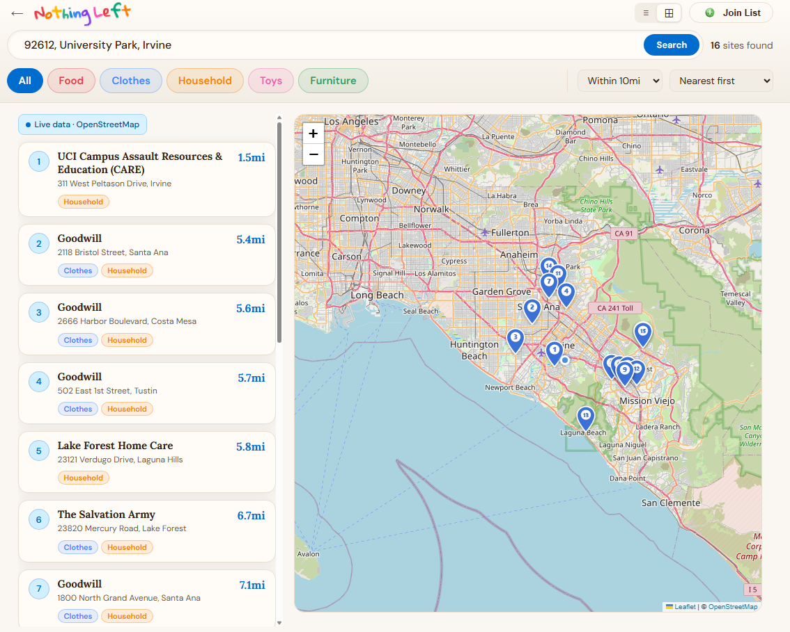

# Nothing Left — Give what you have. Help where it matters.

~ Find Donation Sites · Drop Off What You Have · Help Your Neighborhood ~

## Features
- Search donation sites near any address or use GPS location
- Live data from OpenStreetMap via Overpass API
- Filter sites by category (food, clothes, household, toys, furniture)
- Distance filter (10 mi / 25 mi / 50 mi) — searches only as far as needed for speed
- Two view modes: list and split (map + list)
- Numbered map markers and matching card badges for easy navigation
- Site detail modal with address, hours, phone, website, and Google Maps directions link
- "Join List" form so organizations can request to be added to the directory
- Privacy Notice modal and copyright footer on every page

## Quick Start Example
After running the app locally, search any US address to see nearby donation sites:



The results page shows a live list of nearby donation sites pulled from OpenStreetMap. Use the category chips to filter by type (Food, Clothes, Household, etc.), and toggle between list view and split map+list view using the icons in the top-right of the header.

## Tech Stack
- **React 18** + **Vite** (single-page web app, no backend)
- Live charity data from **Overpass API** (OpenStreetMap)
- Address geocoding via **Nominatim** (OpenStreetMap, no API key required)
- Interactive maps via **Leaflet.js**
- Dev-only tweaks panel (tree-shaken out of production builds)

## Running Locally
```bash
npm install      # first time only
npm run dev      # starts dev server at localhost:5173
npm run build    # production build → dist/
npm run preview  # preview production build locally
```

## Project Structure
```
nothing-left/
├── src/
│   ├── main.jsx              # React entry point (createRoot) + global CSS import
│   ├── App.jsx               # Root component — routing, theme, geocoding
│   ├── index.css             # CSS variables, global reset, keyframe animations
│   ├── constants/
│   │   └── categories.js     # CATEGORIES list + logo color arrays
│   ├── services/
│   │   ├── geocoding.js      # Nominatim forward + reverse geocoding
│   │   └── overpass.js       # Overpass API fetch + OSM element mapper
│   ├── utils/
│   │   └── security.js       # safeUrl, safeTel, hexToRgba helpers
│   ├── components/
│   │   ├── ColorfulLogo.jsx  # Crayon-style animated logo
│   │   ├── Pin.jsx           # Location pin icon
│   │   ├── Badge.jsx         # Colored category/tag badge
│   │   ├── CategoryChip.jsx  # Filter chip with category color
│   │   ├── MapView.jsx       # Leaflet map with numbered markers
│   │   ├── SiteCard.jsx      # Donation site list card
│   │   ├── SiteMapPreview.jsx# Mini Leaflet map shown in site detail
│   │   ├── SiteDetail.jsx    # Site detail modal (centered overlay)
│   │   ├── HeroCarousel.jsx  # Landing page photo carousel
│   │   ├── Footer.jsx        # Footer with Privacy Notice and copyright
│   │   ├── JoinListModal.jsx # Form modal for organizations to join the list
│   │   └── PrivacyModal.jsx  # Privacy policy modal
│   ├── pages/
│   │   ├── Landing.jsx       # Home page — address search + hero
│   │   └── Results.jsx       # Search results — list/split views
│   └── dev/
│       └── TweaksPanel.jsx   # Dev-only theme & layout tweaks panel
│
├── public/
│   └── images/
│       ├── hero-1.jpg … hero-6.jpg   # Hero carousel photos
│       ├── joinlist.png              # Join List button icon
│       └── example.png              # Example screenshot for README
│
├── index.html
├── vite.config.js
├── package.json
└── README.md
```

## Pages
| Page | Component | Description |
|---|---|---|
| Landing | `Landing` | Address search, GPS, hero carousel |
| Results | `Results` | Donation site list, map, and filters |

## Donation Categories
| Category | Color |
|---|---|
| Food | `#E63946` |
| Clothes | `#3A86FF` |
| Household | `#F77F00` |
| Toys | `#F15BB5` |
| Furniture | `#2A9D5C` |

## Data Sources
| Source | Purpose |
|---|---|
| Overpass API | Live charity shop, food bank, and social facility data |
| Nominatim | Address geocoding and reverse geocoding |
| OpenStreetMap Tiles | Map tile rendering via Leaflet |

## Google Sheets Integration (Join List)
The "Join List" form submits to a Google Apps Script Web App. To activate:

1. Create a Google Sheet and deploy a Google Apps Script as a Web App
2. Paste the deployment URL into `src/components/JoinListModal.jsx`:
   ```js
   const SHEET_URL = 'YOUR_GOOGLE_APPS_SCRIPT_URL_HERE';
   ```

## Changelog

### 2026-05-16
- Added "Join List" modal form for organizations to request listing
- Added Privacy Notice modal and footer copyright on all pages
- Distance filter now dynamically scopes Overpass API radius for faster results
- Improved UX

### 2026-05-10
- Initial release: landing page, results page with list/split/map views

---
## 👤 Author
Ricy Hsu

---
## 📅 Last Updated
May 16, 2026
